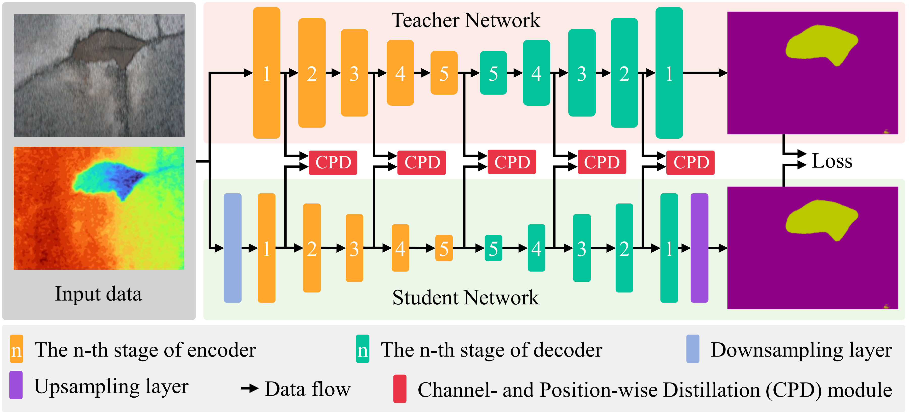

# CPKD-PyTorch
The official pytorch implementation of **CPKD: Channel and Position-wise Knowledge Distillation for Segmentation of Negative Obstacles**. 

CPKD is a knowledge distillation framework for the segmentation of positive obstacles which can transfer knowledge between two feature maps with different resolutions and channel numbers

We test our code in Python 3.7, CUDA 11.1, cuDNN 8, and PyTorch 1.7.1. We provide `Dockerfile` to build the docker image we used. You can modify the `Dockerfile` as you want.  

<div align=center>

</div>

# Dataset

You can download our release dataset **NO-4K** from [Here]() with password **cpkd**. 

# Pretrained weights
The pre-trained weights of the teacher network and student network of CPKD can be downloaded from [here](https://labsun-me.polyu.edu.hk/zfeng/MAFNet/).

# Usage
* Clone this repo
```
$ git clone https://github.com/lab-sun/CPKD.git
```
* Build docker image
```
$ cd ~/CPKD
$ docker build -t docker_image_cpkd .
```
* Download the dataset
```
$ (You should be in the CPKD folder)
$ mkdir ./dataset
$ cd ./dataset
$ (download our preprocessed dataset.zip in this folder)
$ unzip -d .. dataset.zip
```
* To reproduce our results, you need to download our pre-trained weights.
```
$ (You should be in the CPKD folder)
$ mkdir ./weights_backup
$ cd ./weights_backup
$ (download our preprocessed weights.zip in this folder)
$ unzip -d .. weights.zip
$ docker run -it --shm-size 8G -p 1234:6006 --name docker_container_cpkd --gpus all -v ~/CPKD:/workspace docker_image_cpkd
$ (currently, you should be in the docker)
$ cd /workspace
$ python3 run_demo.py
```
The results will be saved in the `./runs` folder.
* To train CPKD
```
$ (You should be in the CPKD folder)
$ docker run -it --shm-size 8G -p 1234:6006 --name docker_container_cpkd --gpus all -v ~/CPKD:/workspace docker_image_cpkd
$ (currently, you should be in the docker)
$ cd /workspace
$ python3 train_student.py
```
* To see the training process
```
$ (fire up another terminal)
$ docker exec -it docker_container_cpkd /bin/bash
$ cd /workspace
$ tensorboard --bind_all --logdir=./runs/tensorboard_log/
$ (fire up your favorite browser with http://localhost:1234, you will see the tensorboard)
```
The results will be saved in the `./runs` folder.
Note: Please change the smoothing factor in the Tensorboard webpage to `0.999`, otherwise, you may not find the patterns from the noisy plots. If you have the error `docker: Error response from daemon: could not select device driver`, please first install [NVIDIA Container Toolkit](https://docs.nvidia.com/datacenter/cloud-native/container-toolkit/install-guide.html) on your computer!

# Citation
If you use CPKD in your academic work, please cite:
```

```

# Acknowledgement
Some of the codes are borrowed from [RTFNet](https://github.com/yuxiangsun/RTFNet) and [MAFNet](https://github.com/lab-sun/MAFNet)

Contact: yx.sun@polyu.edu.hk

Website: https://yuxiangsun.github.io/
